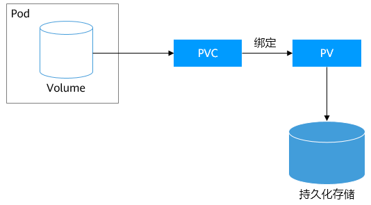

# K8S进阶

## pod

- [pod探活](https://jimmysong.io/kubernetes-handbook/guide/configure-liveness-readiness-probes.html)

## configmap

- 根据配置文件生成configmap `kubectl create configmap conf-test --from-file=config.yaml`
- 以yaml格式查看生产的configmap `kubectl get config conf-test -o yaml`

## [华为云PV && PVC && StorageClass](https://support.huaweicloud.com/basics-cce/kubernetes_0030.html)

- pv,pvc和底层存储关系:
- pv和pvc创建yaml可以查看./pv目录下的example*文件
- Kubernetes提供了CSI接口（Container Storage Interface，容器存储接口）,查看华为云的`kubectl get po --namespace=kube-system`
- 查询支持当前节点支持的storageClass `kubectl get sc`
- [持久卷类型](https://kubernetes.io/zh-cn/docs/concepts/storage/persistent-volumes/#types-of-persistent-volumes)

## DevOps

- Gitlab CI/CD对接华为云
    - [参考资料](https://support.huaweicloud.com/bestpractice-cce/cce_bestpractice_0324.html)
- Jenkins安装部署
    - [参考资料](https://support.huaweicloud.com/bestpractice-cce/cce_bestpractice_0066.html)
    - 获取华为云镜像仓库docker-hub[登陆口令](https://support.huaweicloud.com/usermanual-swr/swr_01_1000.html)